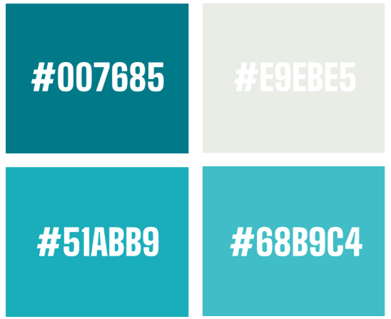

# Addressable LEDs | 6357 Spring Konstant


The SK26Lights subsystem controls a WS2812B addressable LED strip. It handles animations, color correction, and automatic state changes based on robot status.

---

## Table of Contents

- [Quick Reference](#quick-reference)
- [Hardware Setup](#hardware-setup)
- [How It Works](#how-it-works)
- [Automatic Game States](#automatic-game-states)
- [Available Effects](#available-effects)
- [Interactive Games](#interactive-games)
- [SmartDashboard Controls](#smartdashboard-controls)
- [Color Correction](#color-correction)
- [Calibration Mode](#calibration-mode)
- [Controller Bindings](#controller-bindings)
- [SK Brand Colors](#sk-brand-colors)
- [Source Files](#source-files)
- [Troubleshooting](#troubleshooting)

---

## Quick Reference

| Mode | Command | Description |
|------|---------|-------------|
| Off | `setOff()` | All LEDs off |
| Solid White | `setSolidWhite()` | All LEDs white |
| Solid Red | `setSolidRed()` | All LEDs red |
| Solid Blue | `setSolidBlue()` | All LEDs blue |
| Solid Green | `setSolidGreen()` | All LEDs green |
| Solid Yellow | `setSolidYellow()` | All LEDs yellow |
| Solid Orange | `setSolidOrange()` | All LEDs orange |
| Rainbow | `setRainbow()` | Scrolling rainbow at 0.5 m/s |
| SK Breathing | `setBreathingSKBlue()` | SK Blue with breathing brightness |
| SK Gradient | `setSKBlueGradient()` | Scrolling Cream to Teal to Blue to Dark Blue |
| Alliance Gradient | `setAllianceGradient()` | Scrolling gradient in alliance color |
| Auto Lights | `enableAutoLights()` | Automatic game-state-based transitions |
| Party Mode | `activatePartyMode()` | Forces rainbow during auto |

---

## Hardware Setup

| Property | Value |
|----------|-------|
| LED Type | WS2812B Addressable RGB |
| LED Count | 60 (`kLEDBufferLength`) |
| PWM Port | 9 (`kLightsPWMHeader`) |
| Signal | Single data line, direction-sensitive |

<p align="center">
  
</p>

### Wiring

- **Data**: RoboRIO PWM port 9 to LED strip data-in (follow arrow on strip)
- **Power**: 5V supply to LED strip 5V
- **Ground**: Shared ground between RoboRIO and LED power supply

<p align="center">
  
</p>

> **Warning**: Always follow the arrow printed on the LED strip. Data flows in one direction only. Plugging in backwards will result in no output.

---

## How It Works

Every robot loop (20ms), `periodic()` runs the following pipeline:

```
1. Read SmartDashboard color correction values
2. Determine which mode to display (priority order):
     Fun Mode (highest) > Auto Lights > Light Effect Chooser (lowest)
3. If calibrating: run calibration test sequence
   Else: apply the current effect to m_baseBuffer
4. Copy m_baseBuffer into m_buffer
5. Apply color correction to m_buffer
6. Push m_buffer to hardware via m_led.setData()
```

### Two-Buffer Architecture

| Buffer | Purpose |
|--------|---------|
| `m_baseBuffer` | Effects write raw colors here |
| `m_buffer` | Color correction is applied here, then sent to hardware |

This separation keeps effects independent of correction settings. Changing gamma or brightness never requires the effect to re-render.

### Effect Priority

```
Fun Mode ON?
  YES -> use funEffectChooser selection
  NO  -> Auto Lights ON?
           YES -> use game-state logic
           NO  -> use lightEffectChooser selection
```

---

## Automatic Game States

When auto lights are enabled (default), LEDs change automatically based on match status. The subsystem reads `DriverStation` to detect the current phase.

| State | Trigger | Effect | Status |
|-------|---------|--------|--------|
| `PRE_MATCH_NO_FMS` | No Driver Station connected | Breathing SK Blue | "Pre-Match (No DS)" |
| `PRE_MATCH_FMS` | DS or FMS connected, robot disabled | SK Blue Gradient | "Pre-Match (DS Connected)" |
| `AUTO` | Autonomous enabled | Rainbow (Party Mode) | "Auto (Party)" |
| `AUTO_TO_TELEOP` | Autonomous ended, teleop not yet started | Alliance Solid | "Auto to Teleop" |
| `TELEOP` | Teleop enabled | Alliance Gradient | "Teleop (Alliance)" |
| `ENDGAME_FLASH` | Match time 10s or less (first 3s of endgame) | Alliance Flash White | "Endgame (Flash)" |
| `ENDGAME_SOLID` | Match time 7s or less | Alliance Solid | "Endgame (Solid)" |
| `POST_MATCH` | Match ended, robot disabled | Alliance Solid | "Post-Match" |

<p align="center">
  
</p>

### Timing Constants

| Constant | Value | Purpose |
|----------|-------|---------|
| `ENDGAME_START_TIME` | 10.0 seconds | When endgame lighting begins |
| `ENDGAME_FLASH_DURATION` | 3.0 seconds | Duration of the flash phase |

### State Flow

```
PRE_MATCH_NO_FMS --(DS connects)--> PRE_MATCH_FMS
                                          |
                                    (auto starts)
                                          v
                                        AUTO
                                          |
                                    (auto ends)
                                          v
                                    AUTO_TO_TELEOP
                                          |
                                   (teleop starts)
                                          v
                                       TELEOP
                                          |
                                  (10s or less remaining)
                                          v
                                    ENDGAME_FLASH
                                          |
                                  (7s or less remaining)
                                          v
                                    ENDGAME_SOLID
                                          |
                                   (match ends)
                                          v
                                     POST_MATCH
```

---

## Available Effects

### Solid Colors (7)

`OFF`, `SOLID_WHITE`, `SOLID_GREEN`, `SOLID_RED`, `SOLID_BLUE`, `SOLID_YELLOW`, `SOLID_ORANGE`

These use `LEDPattern.solid()` and apply directly to the buffer with no animation.

### Team and Alliance (6)

| Effect | How It Works |
|--------|-------------|
| `RAINBOW` | `LEDPattern.rainbow()` scrolling at 0.5 m/s |
| `BREATHING_SKBLUE` | SK Blue with sine-wave brightness (10% to 100%, approximately 2.5s cycle) |
| `SKBLUE_GRADIENT` | Continuous gradient: Cream, Teal, Blue, Dark Blue scrolling at 0.5 m/s |
| `ALLIANCE_GRADIENT` | Red or blue scrolling gradient based on `DriverStation.getAlliance()` |
| `ALLIANCE_SOLID` | Solid red or blue based on alliance |
| `ALLIANCE_FLASH_WHITE` | Alliance color alternating with white |

### Classic Effects (16)

| Effect | Description |
|--------|-------------|
| `FIRE` | Flickering orange/red flame simulation |
| `POLICE` | Alternating red/blue halves |
| `SPARKLE` | Random white twinkles over SK Blue base |
| `COLOR_CHASE` | Single colored dot racing around the strip |
| `METEOR` | White meteor with exponentially fading tail |
| `THEATER_CHASE` | Classic marquee pattern with rainbow colors |
| `LAVA_LAMP` | Slow-moving warm color blobs |
| `OCEAN_WAVE` | Blue and green wave motion |
| `TWINKLE_STARS` | Random white twinkles appearing and fading |
| `CANDY_CANE` | Red and white alternating stripes |
| `PLASMA` | Smooth flowing color plasma using sine math |
| `KNIGHT_RIDER` | Red scanner bouncing back and forth |
| `HEARTBEAT` | Red pulse mimicking a heartbeat pattern |
| `LIGHTNING` | Random white lightning bolt flashes |
| `CONFETTI` | Random colored sparkles across all LEDs |
| `COMET_TRAIL` | White comet with a fading trail behind it |

### Awesome Effects (26)

| Effect | Description |
|--------|-------------|
| `AURORA_BOREALIS` | Northern lights curtain simulation |
| `GALAXY_SWIRL` | Purple/blue rotating galaxy |
| `NEON_PULSE` | Bright neon color pulses |
| `MATRIX_RAIN` | Green falling code droplets |
| `FIREWORKS` | Exploding colored particle bursts |
| `BREATHING_RAINBOW` | Full rainbow with breathing brightness |
| `WAVE_COLLISION` | Two waves meeting at the center |
| `DISCO_BALL` | Random bright colored spots flashing |
| `CYBERPUNK` | Neon pink/cyan with glitch effects |
| `SNAKE_GAME` | Animated snake with growing tail |
| `RIPPLE` | Expanding ring outward from center |
| `GRADIENT_BOUNCE` | Color gradient bouncing end to end |
| `ELECTRIC_SPARKS` | Random electric spark bursts |
| `SUNSET` | Warm orange/pink gradient |
| `NORTHERN_LIGHTS` | Green/blue curtain effect |
| `PACMAN` | Animated Pacman with ghosts |
| `SOUND_WAVE` | Oscillating waveform display |
| `DNA_HELIX` | Double helix rotation |
| `PORTAL` | Swirling vortex effect |
| `HYPNOTIC_SPIRAL` | Rotating spiral pattern |
| `PIXEL_RAIN` | Colored drops falling down the strip |
| `FIREFLIES` | Randomly glowing yellow dots |
| `NYAN_CAT` | Nyan Cat with rainbow trail |
| `RACING_STRIPES` | Multiple colored lines racing |
| `DRIP` | Color drops dripping downward |
| `GODZILLA_CHARGING` | Charging energy beam effect |

All effects are implemented in `LightEffects.java` (approximately 2600 lines) and called from the `applyCurrentMode()` switch statement in `SK26Lights.java`.

---

## Interactive Games

Five LED games are playable through the Fun Effects chooser. Each game runs on the LED strip and is controlled via Xbox controller buttons.

### Enabling Game Controller Mode

Press **Operator Back** to toggle Game Controller Mode. When enabled, the operator ABXY buttons become game inputs instead of controlling other subsystems like the turret.

### Stop The Light

A light bounces back and forth along the strip. Press the button to stop it on the green target zone.

| Player | Button |
|--------|--------|
| Driver | A |
| Operator | Right Stick Press |

### Tug of War

Two players compete to pull a light toward their end of the strip by mashing their button.

| Player | Button | Direction |
|--------|--------|-----------|
| Driver | A | Pull left |
| Operator | Right Stick Press | Pull right |

### Rhythm Game

Notes scroll along the strip. Hit the button when they reach the target zone to score.

| Player | Button |
|--------|--------|
| Driver | A |
| Operator | Right Stick Press |

### Simon Says

The LEDs flash a sequence of colors. Repeat the sequence using the matching ABXY buttons.

| Button | Color |
|--------|-------|
| A | Green |
| B | Red |
| X | Blue |
| Y | Yellow |

Both driver and operator can input colors for Simon Says.

### Color Knockout (1v1)

A competitive reaction game. A color appears and both players race to press the matching button first. Each player has 5 lives.

| Button | Color | Driver (P1) | Operator (P2) |
|--------|-------|-------------|---------------|
| A | Green | Driver A | Operator A |
| B | Red | Driver B | Operator B |
| X | Blue | Driver X | Operator X |
| Y | Yellow | Driver Y | Operator Y |

All games can be reset with the `resetCurrentGame()` command.

---

## SmartDashboard Controls

<p align="center">
  
</p>

### Fun Effects Chooser (Lights/Fun Effects)

Contains every effect and game. Activate by setting `Lights/Fun Mode` to `true`. This overrides auto lights and the serious chooser.

Effects are labeled with emoji prefixes:
- Game controller emoji: Interactive games (Stop The Light, Tug of War, etc.)
- Lizard emoji: Godzilla Charging

### Light Effect Chooser (Lights/Light Effect)

Contains practical effects only (alliance colors, solids, SK brand). Active when Fun Mode is OFF and Auto Lights are disabled. Default selection is Off.

Available options: Off, Alliance Gradient, Alliance Solid, Alliance Flash White, Breathing SK Blue, SK Blue Gradient, Solid White, Solid Red, Solid Blue, Solid Green, Solid Orange, Rainbow.

### Toggle Switches

| Key | Type | Default | Description |
|-----|------|---------|-------------|
| `Lights/Fun Mode` | boolean | false | Enable fun effect chooser (highest priority) |
| `Lights/Game Controller Mode` | boolean | false | Enable ABXY as game buttons |

---

## Color Correction

Every frame, after the effect renders to `m_baseBuffer`, a color correction pipeline processes each LED in `m_buffer` before sending to hardware.

### Pipeline Steps

```
For each LED (skip if pure black):
  1. Normalize RGB to 0.0 through 1.0
  2. Apply gamma correction:  value = value ^ gamma
  3. Apply per-channel multiplier:  value *= channelCorrection
  4. Apply brightness:  value *= brightness
  5. Anti-clip: if any channel > 1.0, scale ALL channels proportionally
  6. Clamp to [0.0, 1.0] and convert back to 0 through 255
```

### Parameters

| Parameter | Default | Range | SmartDashboard Key |
|-----------|---------|-------|--------------------|
| Gamma | 2.8 | 1.0 to 4.0 | `Lights/Gamma` |
| Red Correction | 1.0 | 0.0 to 2.0 | `Lights/Red Correction` |
| Green Correction | 1.0 | 0.0 to 2.0 | `Lights/Green Correction` |
| Blue Correction | 0.85 | 0.0 to 2.0 | `Lights/Blue Correction` |
| Brightness | 1.0 | 0.0 to 3.0 | `Lights/Brightness` |

> **Note**: Blue defaults to 0.85 because WS2812B LEDs tend to run slightly blue-heavy.

<p align="center">
  
</p>

### Anti-Clipping

When brightness pushes a channel above 1.0, standard clipping would distort the color balance. Instead, the system scales all three channels proportionally so the brightest channel hits exactly 1.0 and the color ratio is preserved.

```
Example: RGB (100, 150, 200) at brightness 2.0
  Naive clip:  (200, 255, 255)   blue and green clip, ratio destroyed
  Smart scale: (128, 191, 255)   same ratio, max channel = 255
```

### Quick Tuning Reference

| Problem | Adjustment |
|---------|------------|
| White looks purple/blue | Lower Blue Correction (try 0.7) |
| White looks yellow/green | Lower Green Correction (try 0.8) |
| White looks pink | Lower Red Correction (try 0.8) |
| Everything too dark | Raise Brightness |
| Everything washed out | Raise Gamma or lower Brightness |
| Midtones too dark/contrasty | Lower Gamma (try 2.2) |
| Midtones too flat | Raise Gamma (try 3.0) |

---

## Calibration Mode

A built-in test that cycles through reference colors to help dial in correction values.

| Step | Duration | Color | What to Check |
|------|----------|-------|---------------|
| 0 | 3 seconds | White | Should be neutral, no color tint |
| 1 | 3 seconds | Red | Pure red, no orange or pink |
| 2 | 3 seconds | Green | Pure green |
| 3 | 3 seconds | Blue | Pure blue |
| 4 | 3 seconds | SK Blue | Should match brand swatch |
| 5 | 3 seconds | SK Blue Gradient | Gradient should be smooth |

The sequence loops until stopped. Activate with `startCalibrationTest()`, stop with `stopCalibrationTest()`.

> **Tip**: During calibration, adjust the SmartDashboard correction sliders in real time and watch the colors update live.

---

## Controller Bindings

All bindings are defined in `SK26LightsBinder.java`. Only operator-side buttons are bound for lights.

<p align="center">
  
</p>

### Always Active

| Button | Action |
|--------|--------|
| Operator D-pad Left | Lights Off |
| Operator D-pad Right | SK Blue Gradient |
| Operator Back | Toggle Game Controller Mode |

### Game Controller Mode ON

When game mode is toggled on, operator ABXY become context-sensitive based on the current game:

| Button | Simon Says | Color Knockout (P2) | Other Games |
|--------|-----------|---------------------|-------------|
| A | Green input | P2 Green | Game action |
| B | Red input | P2 Red | Nothing |
| X | Blue input | P2 Blue | Nothing |
| Y | Yellow input | P2 Yellow | Nothing |

### Game Controller Mode OFF

ABXY buttons do nothing for lights. They are free for other subsystem bindings (turret, launcher, etc.).

### Driver Game Buttons

Driver buttons for games are bound separately in the driver binder (not in SK26LightsBinder):

| Button | Simon Says | Color Knockout (P1) | Other Games |
|--------|-----------|---------------------|-------------|
| Driver A | Green input | P1 Green | Game action |
| Driver B | Red input | P1 Red | n/a |
| Driver X | Blue input | P1 Blue | n/a |
| Driver Y | Yellow input | P1 Yellow | n/a |

---

## SK Brand Colors

| Name | RGB | Hex | Usage |
|------|-----|-----|-------|
| SK Cream | (233, 235, 229) | #E9EBE5 | Gradient start |
| SK Teal | (104, 185, 196) | #68B9C4 | Gradient middle |
| SK Blue | (81, 171, 185) | #51ABB9 | Primary brand color, breathing effect |
| SK Dark Blue | (0, 118, 133) | #007685 | Gradient end |

<p align="center">
  
</p>

These are defined in `Konstants.LightsConstants` and used by `LightPatterns` for the SK Blue Gradient effect.

---

## Source Files

| File | Location | Lines | Purpose |
|------|----------|-------|---------|
| `SK26Lights.java` | `subsystems/lights/` | ~830 | Main subsystem: state machine, commands, calibration, color correction |
| `LightEffects.java` | `subsystems/lights/` | ~2600 | All effect and game implementations |
| `LightPatterns.java` | `subsystems/lights/` | ~65 | WPILib LEDPattern instances (solid, gradient, rainbow) |
| `LightMode.java` | `subsystems/lights/` | ~70 | Enum of all 55+ effect names |
| `GameState.java` | `subsystems/lights/` | ~18 | Enum of 8 automatic game states |
| `SK26LightsBinder.java` | `bindings/` | ~120 | Operator controller button bindings |
| `Konstants.java` | `robot/` | n/a | LightsConstants inner class (PWM port, buffer length, brand colors) |

> See also: [Adding Light Effects](Adding-Light-Effects.md) for a step-by-step guide on creating custom effects.

---

## Troubleshooting

| Symptom | Likely Cause | Fix |
|---------|-------------|-----|
| LEDs don't turn on at all | Wrong PWM port or wiring | Verify port 9 in Konstants, check data-in direction on strip |
| LEDs flicker or glitch | Insufficient power or missing common ground | Use dedicated 5V supply, share ground with RoboRIO |
| Only first few LEDs work | Bad solder joint or dead LED | Check continuity at the dead point |
| Colors look wrong or tinted | Correction values off | Run calibration test, adjust per-channel correction |
| Animations don't change | Command not scheduling | Verify ignoringDisable(true) is set on the command |
| Stuck on one effect | Priority conflict | Check: Fun Mode overrides Auto Lights overrides Light Effect chooser |
| Game buttons don't respond | Game Controller Mode is OFF | Press Operator Back to toggle on |
| Wrong game getting input | Fun Effect chooser set to different game | Check Lights/Fun Effects dropdown |
| Auto lights not transitioning | autoLightsEnabled is false | Call enableAutoLights() or restart robot |
| Endgame flash doesn't trigger | Match time not counting down | Only works with real FMS or practice match timer |

---

*Documentation for FRC Team 6357 - Spring Konstant*