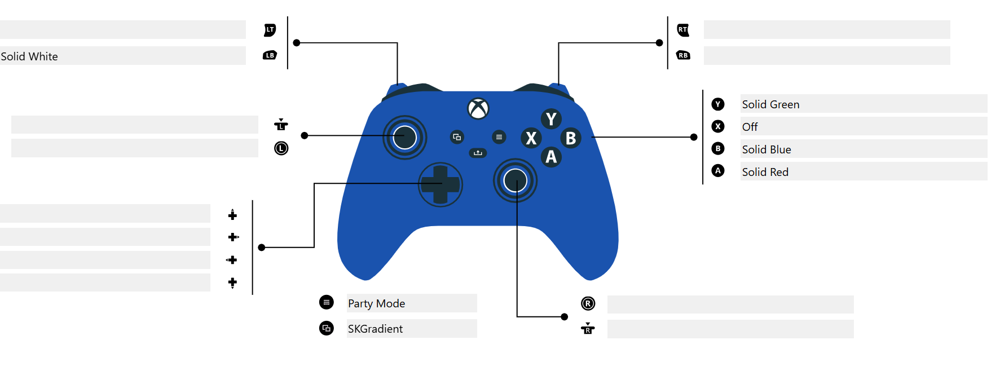
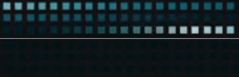
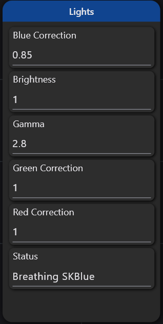
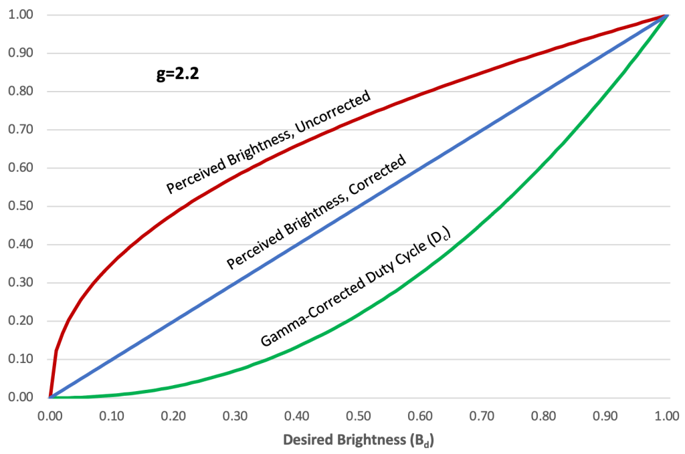
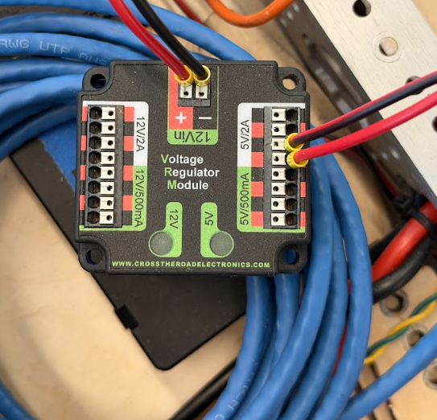
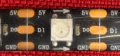

# Addressable LEDs | 6357 Spring Konstant! 


The SK26Lights subsystem controls a WS2812B addressable LED strip. It handles animations, color correction, and automatic state changes based on robot status.

---

## Quick Reference

| Mode | Command | Button | Description |
|------|---------|--------|-------------|
| Off | `setOff()` | X | All LEDs off |
| Red | `setSolidRed()` | A | Solid red |
| Blue | `setSolidBlue()` | B | Solid blue |
| Alliance Gradient | `setAllianceGradient()` | Y | Auto-detect alliance, scrolling gradient |
| White | `setSolidWhite()` | Left Bumper | Solid white |
| SK Breathing | `setBreathingSKBlue()` | Right Bumper | Breathing SK Blue |
| Rainbow | `activatePartyMode()` | Start | Party mode rainbow |
| SK Gradient | `setSKBlueGradient()` | Back | Scrolling SK brand colors |

### Fun Effects (SmartDashboard Only)

These effects are available via SmartDashboard chooser (`Lights/Fun Effects`), not controller buttons:

| Effect | Description |
|--------|-------------|
| Fire | Flickering orange/red flames |
| Police | Alternating red/blue halves |
| Sparkle | SK gradient with white twinkles |
| Color Chase | Cyan dot chasing around strip |
| Meteor | White meteor with fading tail |
| Theater Chase | Classic marquee style rainbow |

To use: Set `Lights/Fun Mode` to `true` in SmartDashboard, then select effect from `Lights/Fun Effects` dropdown.



---

## Automatic States

The lights change automatically based on robot connection status. These are set up in `SK26LightsBinder.java`.

| State | Animation | Why |
|-------|-----------|-----|
| DS Disconnected | Breathing Blue | Shows robot is on but not connected |
| DS Connected + Disabled | SK Gradient | Shows connection is good, waiting to enable |

You can override these at any time with a button press. The automatic state only triggers on the transition (when the state changes).

<p align="center">
  
</p>

---

## SmartDashboard Settings

All settings are under `Lights/` in SmartDashboard or Elastic.

| Setting | Default | Range | What it does |
|---------|---------|-------|--------------|
| Gamma | 2.8 | 1.0 - 4.0 | Brightness curve. Lower = brighter midtones, higher = more contrast |
| Red Correction | 1.0 | 0.0 - 2.0 | Multiplier for red channel |
| Green Correction | 1.0 | 0.0 - 2.0 | Multiplier for green channel |
| Blue Correction | 0.85 | 0.0 - 2.0 | Multiplier for blue channel |
| Brightness | 1.0 | 0.0 - 3.0 | Overall brightness multiplier |



### How Brightness Works

The brightness setting multiplies all color values. Setting it above 1.0 makes everything brighter, but the code is smart about it.

When brightness would cause colors to clip (go above 255), instead of just cutting off the values, it scales everything proportionally. This keeps gradients looking smooth instead of turning into solid blobs of color.

Example at brightness 2.0:
- A color at (100, 150, 200) would normally become (200, 300, 400)
- Since 400 > 255, we scale everything so the max hits 255
- Result: (128, 191, 255) - same color ratios, no clipping

### How Gamma Works

Gamma correction adjusts how brightness is distributed across the range.

- Gamma 1.0 = linear (what you put in is what you get)
- Gamma 2.8 = darker midtones, better contrast (default)
- Gamma 3.5 = even darker midtones, very punchy

LEDs don't display brightness linearly, so gamma correction makes colors look more natural.



### How Color Correction Works

Each color channel has a multiplier. The defaults are calibrated for our LED strips:

- Red: 1.0 (no change)
- Green: 1.0 (no change)  
- Blue: 0.85 (slightly reduced because our strips run a bit blue)

---

## SK Brand Colors

These are defined in `Konstants.java` under `LightsConstants`.

| Name | RGB | Hex | Used In |
|------|-----|-----|---------|
| SK Cream | (233, 235, 229) | #E9EBE5 | Gradient highlight |
| SK Teal | (104, 185, 196) | #68B9C4 | Gradient |
| SK Blue | (81, 171, 185) | #51ABB9 | Breathing, Gradient |
| SK Dark Blue | (0, 118, 133) | #007685 | Gradient shadow |

The gradient scrolls through these colors in order: Cream → Teal → Blue → Dark Blue → repeat.


---

## Hardware Setup

| Property | Value |
|----------|-------|
| PWM Port | 9 |
| LED Count | ~60 (will change) |
| LED Type | WS2812B (addressable RGB) |
| Data Direction | Check the arrows on your strip |

The LED strip needs:
- 5V power (from VRM or dedicated 5V supply)
- Ground (shared with roboRIO)
- Data line to PWM port 9



Make sure the data direction arrow on the strip points away from the roboRIO.



---

## Code Structure

### Files

| File | Purpose |
|------|---------|
| `SK26Lights.java` | Main subsystem, handles all LED logic |
| `SK26LightsBinder.java` | Button bindings and automatic state triggers |
| `Konstants.java` | LED count, PWM port, SK brand colors |

### BaseMode Enum

All available modes are defined in the `BaseMode` enum inside `SK26Lights.java`:

```java
private enum BaseMode {
    OFF,
    SOLID_WHITE,
    SOLID_GREEN,
    SOLID_RED,
    SOLID_BLUE,
    SOLID_YELLOW,
    SOLID_ORANGE,
    RAINBOW,
    BREATHING_SKBLUE,
    SKBLUE_GRADIENT
}
```

### How Updates Work

Every robot loop (50 times per second):

1. `updateCalibrationValues()` - reads SmartDashboard settings
2. `applyBaseMode()` - writes the current animation to `m_baseBuffer`
3. `copyBaseToMain()` - copies base buffer to main buffer
4. `applyColorCorrection()` - applies gamma, color correction, and brightness
5. `m_led.setData(m_buffer)` - sends the final data to the LEDs

The two-buffer system exists so we could add overlays in the future (like alerts blinking on top of the base animation).

---

## Adding New Modes

### Step 1: Add to BaseMode enum

```java
private enum BaseMode {
    // ...existing modes...
    MY_NEW_MODE
}
```

### Step 2: Create the pattern

For a solid color:
```java
private final LEDPattern m_myColor = LEDPattern.solid(Color.kPurple);
```

For a gradient:
```java
private final LEDPattern m_myGradient = LEDPattern.gradient(
    LEDPattern.GradientType.kContinuous,
    Color.kRed,
    Color.kBlue
).scrollAtAbsoluteSpeed(MetersPerSecond.of(0.5), kLedSpacing);
```

For a custom animation, create a method like `applyBreathingSKBlue()`.

### Step 3: Add to applyBaseMode()

```java
private void applyBaseMode() {
    switch (currentBaseMode) {
        // ...existing cases...
        case MY_NEW_MODE:
            m_myColor.applyTo(m_baseBuffer);
            break;
    }
}
```

### Step 4: Create the public command

```java
public Command setMyNewMode() {
    return setMode(BaseMode.MY_NEW_MODE, "My New Mode");
}
```

### Step 5: Bind to a button (optional)

In `SK26LightsBinder.java`:
```java
someButton.onTrue(lights.setMyNewMode().ignoringDisable(true));
```

---

## Tuning Guide

### White Looks Wrong

| Problem | Fix |
|---------|-----|
| Purple/blue tint | Lower Blue Correction (try 0.7) |
| Yellow/green tint | Lower Green Correction (try 0.8) |
| Pink tint | Lower Red Correction (try 0.8) |

### Brightness Issues

| Problem | Fix |
|---------|-----|
| Too dark overall | Raise Brightness (try 1.5 or 2.0) |
| Too bright/washed out | Lower Brightness or raise Gamma |
| Midtones look wrong | Adjust Gamma (2.2 = brighter mids, 3.0 = darker mids) |

### Gradients Look Bad

| Problem | Fix |
|---------|-----|
| Colors bleeding together | Raise Gamma |
| Sharp transitions | Lower Gamma |
| Gradient looks solid at high brightness | This is fixed in code, but check that brightness isn't crazy high |

---

## Breathing Animation Details

The breathing effect uses a sine wave to smoothly fade the SK Blue color.

- Speed: 0.05 radians per loop (about 2.5 seconds per cycle)
- Minimum brightness: 10%
- Maximum brightness: 100%

The formula:
```java
// breatheAmount goes from 0 to 1 based on sine wave
double breatheAmount = (Math.sin(breathePhase) + 1.0) / 2.0;
// Map to 10% - 100% range
double breatheBrightness = 0.1 + (breatheAmount * 0.9);
```

---

## Notes

- All LED commands use `.ignoringDisable(true)` so they work even when the robot is disabled
- Color correction is applied after the animation, so animations don't need to worry about it

---

## Troubleshooting

| Issue | Possible Cause | Solution |
|-------|----------------|----------|
| LEDs not turning on | Wrong PWM port | Check `kLightsPWMHeader` in Konstants.java |
| LEDs flickering | Power issue | Use a dedicated 5V supply, not the roboRIO |
| Only some LEDs work | Bad connection | Check data line, might have a dead LED |
| Colors look wrong | Calibration | Adjust correction values in SmartDashboard |
| Animations not changing | Command not scheduled | Make sure `.ignoringDisable(true)` is on the command |
| Stuck on one mode | Trigger issue | Check the binder for conflicting triggers |

---

*Documentation for FRC Team 6357 - Spring Konstant*