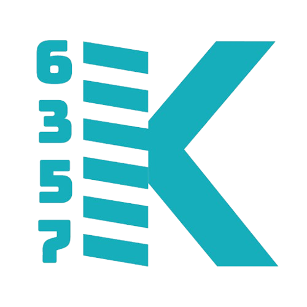

# Swerve Drive Subsystem | 6357 Spring Konstant



The swerve drive subsystem (`SKSwerve`) controls the robot's movement using a CTRE Phoenix 6 swerve drivetrain with four independently steered and driven modules. It integrates with PathPlanner for autonomous driving and supports vision-assisted pose estimation through a Kalman filter.

---

## Table of Contents

- [Overview](#overview)
- [Architecture](#architecture)
- [Hardware](#hardware)
- [Drive Modes](#drive-modes)
- [Pose Estimation](#pose-estimation)
- [Autonomous Integration](#autonomous-integration)
- [Telemetry](#telemetry)
- [Constants & Tuning](#constants--tuning)
- [Commands](#commands)
- [Controller Bindings](#controller-bindings)
- [Key Classes & Files](#key-classes--files)
- [Troubleshooting](#troubleshooting)

---

## Overview

`SKSwerve` wraps CTRE's Phoenix 6 `SwerveDrivetrain` inside a WPILib `SubsystemBase` so it integrates cleanly with the command-based framework. The subsystem:

1. Reads joystick inputs and converts them into `SwerveRequest` objects  
2. Maintains a **SwerveDrivePoseEstimator** that fuses wheel odometry + vision  
3. Feeds PathPlanner with the current pose and accepts autonomous chassis speeds  
4. Publishes rich telemetry to NetworkTables / SmartDashboard / AdvantageScope  

<p align="center">
  
</p>

---

## Architecture

```
SKSwerve (SubsystemBase)
├── GeneratedDrivetrain   ← CTRE Phoenix 6 generated swerve drivetrain
│   ├── Module 0 (FL)     ← TalonFX drive + TalonFX steer + CANcoder
│   ├── Module 1 (FR)
│   ├── Module 2 (BL)
│   └── Module 3 (BR)
├── SwerveDrivePoseEstimator  ← WPILib Kalman filter (odometry + vision fusion)
├── DriveRequests         ← Static swerve request objects (teleop, auto, robot-centric)
├── GeneratedConstants    ← Tuner X generated PID, gear ratios, offsets
├── GeneratedTelemetry    ← Real-time module state logging
└── SKTargetPoint         ← Field target point for alignment commands
```

### Request Flow

```
Joystick → DriveRequests.teleopRequest (FieldCentric) → SKSwerve.setSwerveRequest()
                                                              ↓
                                                   GeneratedDrivetrain.applyRequest()
                                                              ↓
                                                   Individual TalonFX modules
```

During autonomous, PathPlanner replaces the joystick input:

```
PathPlanner → ChassisSpeeds → DriveRequests.pathPlannerRequest (ApplyRobotSpeeds) → SKSwerve.setSwerveRequest()
```

> **Safety**: `setSwerveRequest()` rejects all non-PathPlanner requests during autonomous mode, preventing accidental joystick interference.

---

## Hardware

### CAN Bus

All swerve devices share the **SwerveCANivore** CAN bus for high-speed (1 ms) communication.

| Component | Type | CAN ID | Notes |
|-----------|------|--------|-------|
| Pigeon 2 IMU | IMU | 5 | Yaw source for field-centric driving |
| FL Drive Motor | TalonFX | See GeneratedConstants | Integrated encoder |
| FL Steer Motor | TalonFX | See GeneratedConstants | Fused CANcoder feedback |
| FL CANcoder | CANcoder | See GeneratedConstants | Absolute steer position |
| FR Drive Motor | TalonFX | See GeneratedConstants | - |
| FR Steer Motor | TalonFX | See GeneratedConstants | - |
| FR CANcoder | CANcoder | See GeneratedConstants | - |
| BL Drive Motor | TalonFX | See GeneratedConstants | - |
| BL Steer Motor | TalonFX | See GeneratedConstants | - |
| BL CANcoder | CANcoder | See GeneratedConstants | - |
| BR Drive Motor | TalonFX | See GeneratedConstants | - |
| BR Steer Motor | TalonFX | See GeneratedConstants | - |
| BR CANcoder | CANcoder | See GeneratedConstants | - |

### Physical Specs

| Property | Value |
|----------|-------|
| Chassis Dimensions | 28" × 28" |
| Wheel Radius | 2 inches |
| Drive Gear Ratio | 6.03:1 |
| Steer Gear Ratio | 26.09:1 |
| Max Speed (12V) | 5.12 m/s |
| Left Side Inverted | No |
| Right Side Inverted | Yes |

<p align="center">
  
</p>

---

## Drive Modes

### 1. Field-Centric Teleop (Default)

The robot drives relative to the field. "Forward" on the joystick always means toward the far wall, regardless of robot heading.

| Speed Mode | Trigger | Max Translational Speed | Max Rotational Speed |
|------------|---------|------------------------|---------------------|
| Normal | Default | 5.12 m/s (100%) | 1.25 rot/s |
| Slow | Left Bumper held | 1.54 m/s (30%) | 0.625 rot/s (50%) |
| Fast | Left Stick pressed | 8.96 m/s (175%) | 2.5 rot/s (200%) |

### 2. Robot-Centric Teleop

The robot drives relative to its own heading. "Forward" on the joystick means the direction the robot is facing. Activated by holding the **Right Bumper**.

### 3. PathPlanner Autonomous

PathPlanner sends `ChassisSpeeds` and `DriveFeedforwards` which are applied via the `ApplyRobotSpeeds` request. The system uses the following PID controllers:

| Axis | kP | kI | kD |
|------|-----|-----|-----|
| Translation | 6.4 | 0.05 | 0 |
| Rotation | 6.0 | 0.4 | 0 |

### 4. Point Alignment

When the Left Trigger is held, the robot automatically rotates to face a target point on the field while the driver still controls translation. Uses the `AlignAroundPoint` command with PID:

| Parameter | Value |
|-----------|-------|
| kP | 0.85 |
| kI | 0.1 |
| kD | 0.03 |
| Tolerance | 2° |

### 5. Bump Jump Alignment

The `AlignForBumpJump` command snaps the robot to the nearest 45° diagonal angle (45°, 135°, -45°, -135°) for climbing over field bumps. Uses a 10° tolerance.

<p align="center">
  
</p>

---

## Pose Estimation

The drivetrain maintains a **SwerveDrivePoseEstimator** which fuses:

1. **Wheel odometry** — updated every loop from module positions + gyro  
2. **Vision measurements** — added by the Vision subsystem with configurable standard deviations  

```
periodic() {
    poseEstimator.update(gyroRotation, modulePositions);  // Odometry
    // Vision subsystem calls addVisionMeasurement() separately
}
```

### Vision Integration API

| Method | Purpose |
|--------|---------|
| `addVisionMeasurement(Pose2d, timestamp)` | Add a vision pose with default std devs |
| `addVisionMeasurement(Pose2d, timestamp, stdDevs)` | Add with custom std devs |
| `setVisionMeasurementStdDevs(Matrix)` | Change how much to trust vision |

### Field Boundary Enforcement

The `keepPoseOnField()` method clamps the estimated pose within the field boundaries, accounting for half the robot chassis length as a margin.

---

## Autonomous Integration

PathPlanner is configured via `AutoBuilder.configure()` with:

- **Pose supplier**: `getRobotPose()` from the pose estimator  
- **Pose resetter**: `resetPose()` to seed auto starting position  
- **Speed supplier**: `drivetrain.getState().Speeds` for current chassis speeds  
- **Drive consumer**: Routes through `setSwerveRequest()` with the PathPlanner request  
- **Alliance flip**: Automatically mirrors paths for Red alliance  

### Default Pathfinding Constraints

| Constraint | Value |
|------------|-------|
| Max Velocity | 3.5 m/s |
| Max Acceleration | 3.0 m/s² |
| Max Angular Velocity | 540 °/s |
| Max Angular Acceleration | 720 °/s² |

---

## Telemetry

### SmartDashboard

| Key | Type | Description |
|-----|------|-------------|
| `Drive` | Subsystem data | Full Sendable with per-module data |
| `Drive/RawJoysticks` | double[] | [X, Y, Rot] joystick values |
| `Drive/EstimatedPose` | Pose2d (struct) | Current pose estimate |
| `Drive/ActivePath` | Pose2d[] (struct array) | PathPlanner active trajectory |
| `PathPlanner/Active Path Name` | String | Name of currently running path |

### Per-Module Data (Sendable)

For each module (0-3), the following is published:

| Property | Unit |
|----------|------|
| Drive Volts | V |
| Rotation Volts | V |
| Drive Stator Current | A |
| Rotation Stator Current | A |
| Drive Supply Current | A |
| Rotation Supply Current | A |
| Drive Temperature | °C |
| Rotation Temperature | °C |

### IMU Data

| Property | Unit |
|----------|------|
| Pitch Degrees | ° |
| Pitch Velocity | °/s |
| Roll Degrees | ° |
| Roll Velocity | °/s |

<p align="center">
  
</p>

---

## Constants & Tuning

### Motor PID (CTRE Slot 0)

| Parameter | Steer Motor | Drive Motor |
|-----------|-------------|-------------|
| kP | 100 | 0.1 |
| kI | 0 | 0 |
| kD | 0.5 | 0 |
| kS | 0.1 | 0 |
| kV | 2.49 | 0.124 |
| kA | 0 | — |

### Joystick Filtering

| Parameter | Value |
|-----------|-------|
| Deadband | 0.15 (15%) |
| Default Translation Slew Rate | 4.0 |
| Default Rotation Slew Rate | 4.0 |

Slew rates are adjustable at runtime via `SKPreferences`:
- `driverTranslSlew`  
- `driverRotSlew`  

---

## Commands

| Command | Description | Trigger |
|---------|-------------|---------|
| `DrivetrainRequestApplier` | Default command — continuously applies the current swerve request | Always running |
| `AlignAroundPoint` | Automatically rotates to face a target point while translating freely | Left Trigger (hold) |
| `AlignForBumpJump` | Snaps to nearest 45° diagonal for bump jumping | — |
| `followSwerveRequestCommand(FieldCentric)` | Wraps a field-centric request in a command | Various |
| `followSwerveRequestCommand(RobotCentric)` | Wraps a robot-centric request in a command | Right Bumper (hold) |

---

## Controller Bindings

### Driver Controller (Xbox - Port 0)

| Input | Action |
|-------|--------|
| Left Stick Y | Translation forward/backward |
| Left Stick X | Translation left/right |
| Right Stick X | Rotation |
| Right Bumper (hold) | Robot-centric driving mode |
| Left Bumper (hold) | Slow mode (30% speed) |
| Left Stick Button (hold) | Fast mode (175% speed) |
| Right Stick Button | Reset gyro orientation |
| Left Trigger (hold) | Align to target point |

<p align="center">
  
</p>

---

## Key Classes & Files

| File | Purpose |
|------|---------|
| `subsystems/drive/SKSwerve.java` | Main swerve subsystem — pose estimation, request management, telemetry |
| `subsystems/drive/DriveRequests.java` | Static swerve request objects and request updater factories |
| `subsystems/drive/GeneratedConstants.java` | Tuner X generated constants — PID, gear ratios, CAN IDs, offsets |
| `subsystems/drive/GeneratedDrivetrain.java` | Tuner X generated drivetrain class |
| `subsystems/drive/GeneratedTelemetry.java` | Tuner X generated telemetry logging |
| `subsystems/drive/SKTargetPoint.java` | Manages a target point on the field for alignment |
| `commands/AlignAroundPoint.java` | PID-driven auto-rotation toward a field point |
| `commands/AlignForBumpJump.java` | Snaps rotation to nearest 45° diagonal |
| `bindings/SKSwerveBinder.java` | Driver controller button bindings for swerve |
| `bindings/SKTargetPointsBinder.java` | Operator controller bindings for target point adjustment |
| `Konstants.java` → `DriveConstants` | Max speeds, angular rates, deadbands |
| `Konstants.java` → `AutoConstants` | PathPlanner PID, path constraints |

---

## Troubleshooting

| Symptom | Likely Cause | Fix |
|---------|-------------|-----|
| Robot drifts when stationary | Joystick deadband too low | Increase `kJoystickDeadband` in `OIConstants` |
| Robot spins wildly on enable | Pigeon IMU not calibrated or wrong CAN ID | Check Pigeon CAN ID (5), recalibrate |
| Module wheels jitter | Steer PID too aggressive | Reduce steer kP in `GeneratedConstants` |
| PathPlanner paths drift | Translation PID too low | Increase `kTranslationPIDConstants.kP` |
| Robot doesn't move in auto | `setSwerveRequest()` rejecting — wrong request type | Ensure PathPlanner uses `pathPlannerRequest` |
| Pose jumps randomly | Vision measurements too trusted | Increase vision standard deviations |
| "Failed to load PathPlanner config" error | `RobotConfig` GUI settings missing | Re-run PathPlanner GUI setup |
| Robot drives backwards | Module inversion wrong | Check `kInvertLeftSide` / `kInvertRightSide` |

---

## Target Points

The `SKTargetPoint` subsystem manages named points on the field that the robot or turret can align toward.

### Predefined Points

| Name | Location | Use |
|------|----------|-----|
| Blue Hub | (4.622, 4.030) | Scoring target for blue alliance |
| Red Hub | (11.929, 4.030) | Scoring target for red alliance |
| Operator Controlled | (0, 0) adjustable | Manually positioned by operator via D-pad |

The operator can move the target point in real-time using D-pad buttons, making it useful for shuttling or custom alignment scenarios.

<p align="center">
  
</p>
